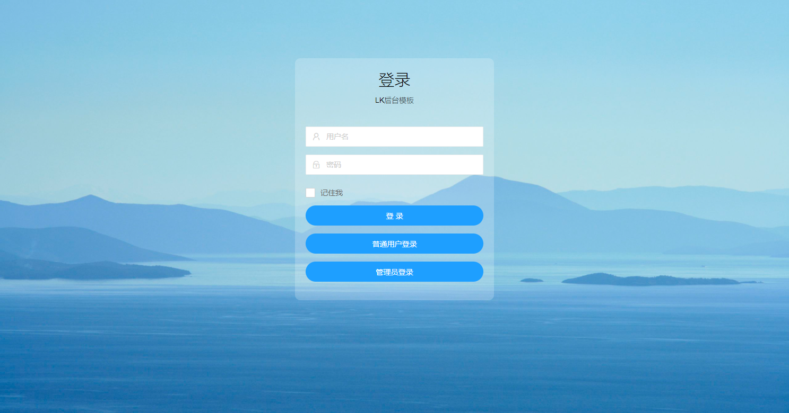
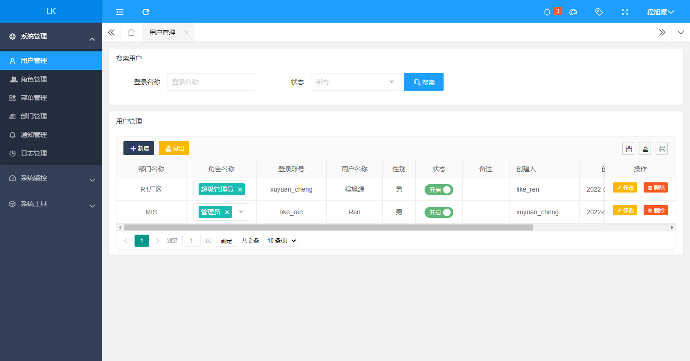
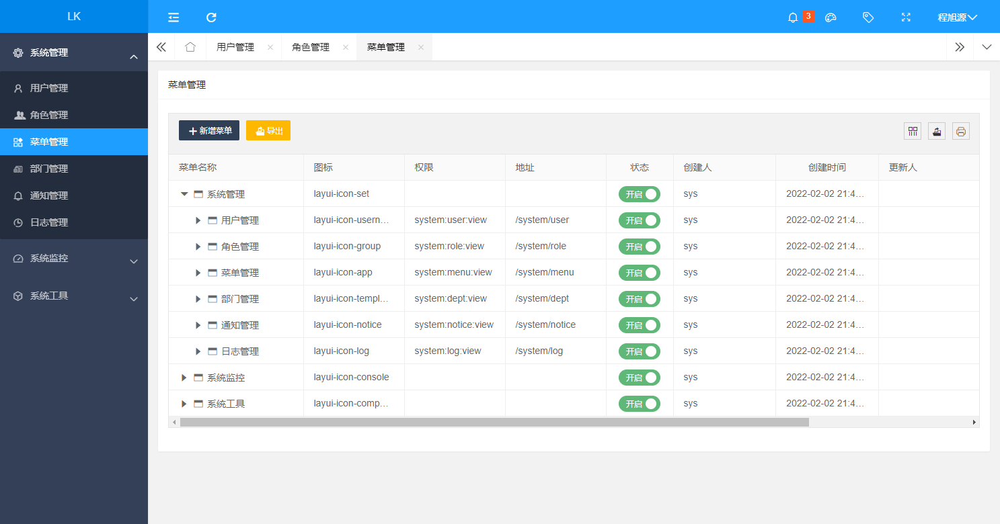
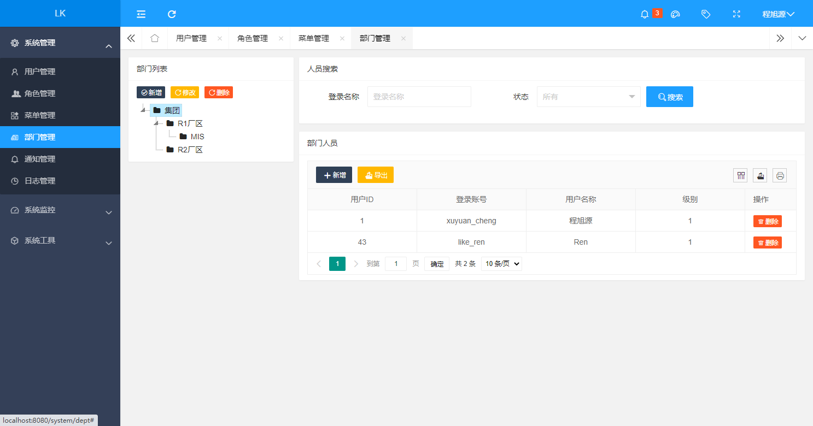
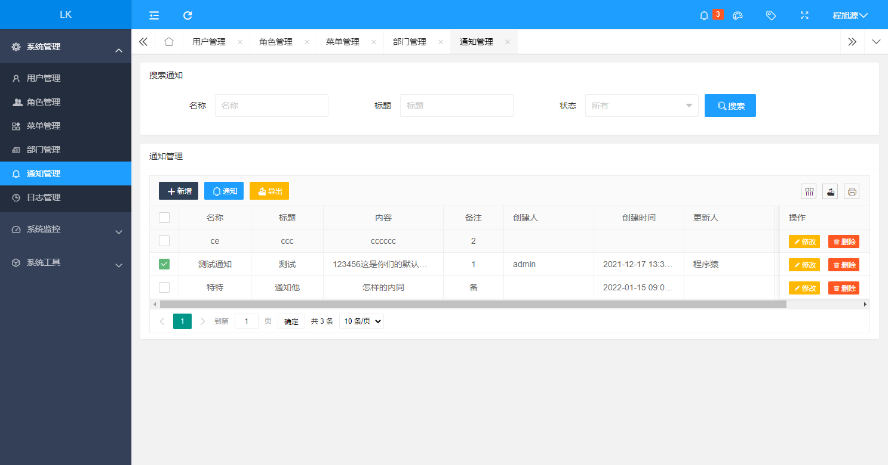
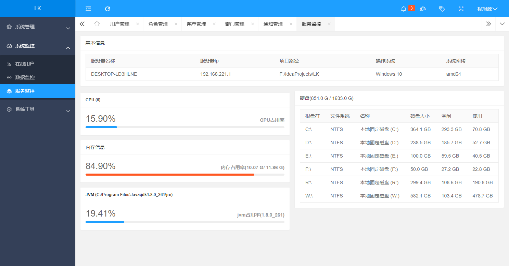
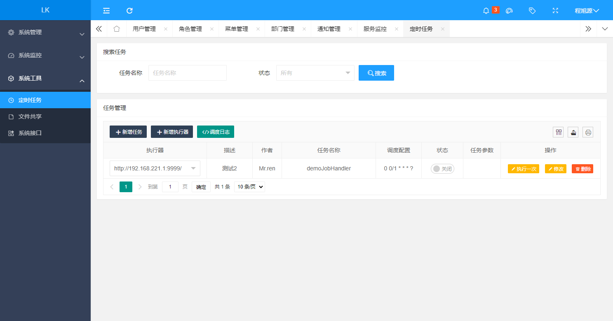
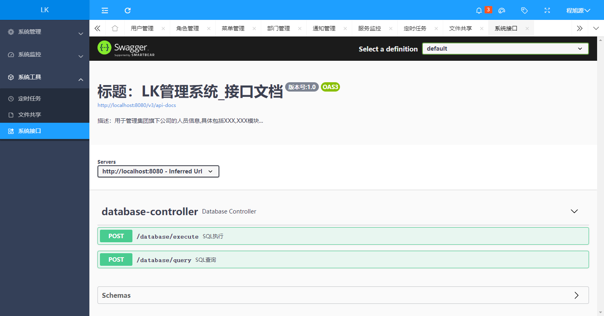

# LK 1.0.0

## 平台简介

LK是一款后台管理系统，基于若依改造上手简单，前端使用layui美观并可自定义，
使用xxl-job做定时任务可实现分布式任务调度

## 快速开始

### 核心依赖

| 依赖                    | 版本    |
| ---------------------- |---------|
| Spring Boot            | 2.6.2   |
| druid                  | 1.2.6   |
| mybatis                | 2.1.4   |
| shiro                  | 1.8.0   |
| xxl-job                | 2.3.0   |

## 内置功能

1.  用户管理：用户是系统操作者，该功能主要完成系统用户配置。
2.  部门管理：配置系统组织机构，树结构展现支持数据权限。
4.  菜单管理：配置系统菜单，操作权限，按钮权限标识等。
5.  角色管理：角色菜单权限分配、设置角色。
6.  通知公告：系统通知公告信息发布维护。
7.  操作日志：系统正常操作日志记录和查询；系统异常信息日志记录和查询。
8. 登录日志：系统登录日志记录查询包含登录异常。
9. 在线用户：当前系统中活跃用户状态监控。
10. 定时任务：在线（添加、修改、删除)任务调度包含执行结果日志。
11. 系统接口：根据业务代码自动生成相关的api接口文档。
12. 服务监控：监视当前系统CPU、内存、磁盘等相关信息。
13. 连接池监视：监视当前系统数据库连接池状态，可进行分析SQL找出系统性能瓶颈。

## 演示图

